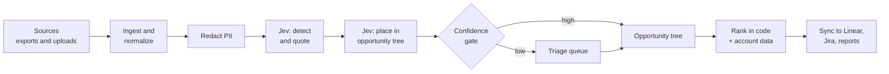

# Groundwork: Product Vision and v1 PRD

Sep 24, 2026 · @Gannon · Working name, draft v0.1

## Summary

Groundwork turns customer conversations into a ranked map of customer problems, with verbatim quotes and revenue attached, and syncs the results into the tracker a product team already uses.

The first release targets product managers at B2B software companies. It ingests sources PMs control: interview transcripts, NPS and survey comments, app reviews, sales call transcripts and ticket exports. Every mention lands in an opportunity tree (outcome, problem, requested solution), and code ranks problems by accounts, revenue and trend.

TypeSafe's Jev model makes each judgment for about $0.00013 per item, or $1.30 per 10,000 items. An LLM writes only the text a person reads. The core is open source under MIT, with a hosted cloud as the revenue center.

The first milestone is a four-week concierge test with 8 PMs before any self-serve build.

## Vision

Every roadmap decision should trace back to what customers said, how many said it, and what those customers are worth.

**The problem.** Customer evidence sits in five or more systems: the support desk, the call recorder, the survey tool, app stores and interview notes. PMs sample it by hand before planning, so the loudest account or the most recent call sets priorities. Current tools capture feature requests and link them to issues. A feature request is a proposed solution, and the product job is to find the problem underneath it and size that problem.

**The belief.** Calibrated judgments at fractions of a cent per item make complete evidence affordable. A team can read 100% of its customer conversations for a few dollars a month. A confidence value on every judgment tells the team which ones need a human.

**Three years out.** Groundwork is the evidence layer under product decisions:

- Every opportunity in a team's tree carries live counts, revenue, trend and quotes.
- Every roadmap item in Linear, Jira or Productboard links back to the evidence behind it.
- CX leaders run voice-of-customer reporting on the same data, and support operations run QA scorecards on the same tickets.
- The open-source core is the default pipeline teams reach for when they want to own their customer evidence.

## Market and positioning

Request capture and issue linking are getting bundled into the tools product teams already pay for, so Groundwork positions one layer up: problems and outcomes, sized by reach and revenue, synced into those tools.

| Product | What it does with customer feedback | Price | Where it stops |
| --- | --- | --- | --- |
| [Linear Customer Requests](https://linear.app/docs/customer-requests) and [Linear agent](https://linear.app/changelog/2025-12-11-linear-agent-for-intercom-zendesk-gong) | Links requests to issues with customer revenue, tier, status and size. The agent files issues from Intercom, Zendesk and Gong and merges duplicates. | Support integrations on Business; Gong on Enterprise | Issue-level; Linear only |
| [Productboard Spark](https://quackback.io/blog/productboard-pricing) | Roadmaps, portal, prioritization; AI insight extraction and auto-linking | $15 per maker per month; 250 AI credits per maker per month | Closed suite; AI metered by credits |
| [Canny Autopilot](https://canny.io/features/autopilot) | Extracts requests from Gong, Intercom, Zendesk, Slack and reviews; merges duplicates; ties to revenue | Free feedback capture; paid plans | Organized around requested features |
| [Unwrap](https://work-management.org/analytics/unwrap-vs-enterpret/) | Automatic theming and spike alerts across feedback sources | About $24,000 per year starting point | Priced for enterprise CX teams |
| [Enterpret](https://work-management.org/analytics/unwrap-vs-enterpret/) | Adaptive taxonomy tied to account revenue | Quote-only; estimates $23,000 to $98,000 per year | Priced for enterprise CX teams |
| [Quackback](https://quackback.io/), [OpenCoven Feedback](https://github.com/OpenCoven/feedback), Fider, Astuto | Open-source boards where customers post and vote on requests | Free self-host; Quackback cloud from $29 per month | Collects explicit posts; no mining of conversations |

**Positioning.** For product teams at B2B software companies deciding what to build, Groundwork maps every customer mention to the problem behind it, sizes each problem by accounts and revenue, and syncs the result into Linear, Jira or Productboard. It is open source and self-hostable.

**Stance toward incumbents.** Integrate with trackers and boards and leave roadmapping to them. Linear Customer Requests and open-source boards become sync targets.

## Users and jobs to be done

The primary user is a PM or head of product at a B2B software company with 20 to 500 employees, 1 to 15 PMs, an engineering-led culture, and Linear or Jira as the tracker.

| Persona | Job to be done | Workaround today |
| --- | --- | --- |
| Product manager (primary) | Before quarterly planning, show which customer problems matter most, with evidence I can defend | Reads 20 to 50 tickets and call notes by hand; tags a spreadsheet |
| Product manager (primary) | When a stakeholder pushes a feature, check how many accounts and how much ARR sit behind it | Asks CS for "top asks"; searches Slack #feedback |
| Product manager (primary) | After shipping, find every account that raised the problem and close the loop | Searches the support desk by keyword; asks account managers |
| Head of product | Show leadership and the board which problems the roadmap addresses and why | Hand-built slides from anecdotes |
| Designer or UX researcher | Code interview transcripts against the team's opportunity tree | Sticky notes, Dovetail tags, spreadsheets |
| Engineering lead | See the customer context behind an issue before scoping it | Reads the linked ticket, if one exists |

The buyer is the head of product. Designers and engineers join as viewers and contributors, which argues for per-workspace pricing over per-seat pricing.

## Product principles

Seven principles decide trade-offs when the PRD is silent.

1. **Evidence first.** Every count, score and ranking clicks through to verbatim quotes and the source record.
2. **Problems over solutions.** The tree's unit is a customer problem. Requested features attach to problems as solution ideas.
3. **Code owns control flow.** Jev answers narrow questions. Code counts, joins, ranks, schedules and handles every number and date.
4. **Uncertainty is visible.** Low-confidence judgments go to a triage queue, and the UI shows confidence wherever it affects a number.
5. **Rubrics are code.** Question packs are versioned files, reviewed like code and tested against labeled examples before rollout.
6. **Meet teams where they plan.** Sync to Linear, Jira and Productboard. v1 ships no roadmap or timeline UI.
7. **Open by default.** MIT core, self-hostable, with a pluggable judge backend so the product runs without a TypeSafe key.

## How it works

Each customer item passes through one Jev request to detect mentions, one or two more to place each mention in the tree, then code that counts, joins revenue and ranks.



Triage decisions flow back as labels for tuning thresholds and question wording.

### Data model

| Entity | Holds |
| --- | --- |
| Source | Connector or upload config, field mapping, sync cursor |
| Item | One ticket, call, survey response, review or interview: text split into numbered sentences, date, account ID, author role |
| Mention | Sentence IDs within an item that state a problem or request |
| Opportunity | Tree node (outcome, problem or solution idea): title, description, owner, parent |
| Placement | Mention to opportunity: answer, probabilities, confidence, judge and model version, human override |
| Account | Account ID, ARR, plan, segment, from CSV or CRM |
| Question pack | Versioned YAML: questions, options, thresholds, pinned model |
| Link | Opportunity to tracker issue or project |

### What Jev does

- **Detect** (one request per item): Nouls for "states a problem," "proposes a solution" and "describes a workaround"; a Score for pain; a Choice for the speaker's role.
- **Quote**: a Choice over sentence IDs picks the sentence that carries each mention, the method in TypeSafe's line-by-line search cookbook.
- **Place**: a hierarchical Choice walks outcome, then problem, keeping the top two branches, per the hierarchical classification cookbook. "None of these" is always an option.
- **Deduplicate**: embeddings pull the 10 nearest problems; a Choice picks the match or none.

### What an LLM does

- Names a proposed opportunity from a cluster of unplaced mentions. A PM approves it before it enters the tree.
- Writes opportunity summaries and the body of synced tracker issues.

### What code does

Counts distinct accounts, sums ARR, computes trends, applies ranking weights, parses dates, and redacts emails, phone numbers and card numbers before any text leaves the server.

### Judge interface

`judge(state, questions) -> answers[{value, probabilities, confidence}]` with two backends: TypeSafe Jev (default) and an LLM with structured output (fallback, including local models for strict self-hosting). Each answer stores its backend and model version, and packs pin `jev-1.13.0` once thresholds are tuned.

### Example question pack

```yaml
pack: product-insights
version: 0.3.0
judge: jev-1.13.0
item_questions:
  states_problem:
    type: noul
    instructions: "Customer describes a problem, limitation or pain with the product"
  proposes_solution:
    type: noul
    instructions: "Customer asks for a specific feature or change"
  workaround:
    type: noul
    instructions: "Customer describes a manual workaround they use today"
  pain:
    type: score
    levels: [mild_annoyance, slows_work, blocks_work, deal_breaker]
  role:
    type: choice
    options: [end_user, admin, buyer, executive, unknown]
thresholds:
  detect: 0.6
  place_confidence: 0.7
```

**Cost.** At an assumed 1,900 tokens per item and 0.8 mentions per item, Jev input runs about 3,100 tokens per item: $0.00013 per item, $1.30 per 10,000 items at $0.042 per million tokens. Processing 10,000 items takes about 26,000 requests, or 22 minutes at the current 1,200 requests-per-minute limit.

## v1 PRD

v1 gives a PM a ranked, evidence-backed opportunity map from their own exports within 30 minutes of signup, and pushes the top problems into Linear.

### Problem

PMs decide priorities from a hand-read sample of customer evidence. Request trackers count proposed features and miss the problems underneath them. Nobody on a 5-PM team has time to read every ticket, call and survey comment each quarter.

### Goals

- A new workspace reaches its first ranked opportunity map within 30 minutes of signup.
- Every opportunity shows distinct accounts, ARR, mention count, trend and quotes.
- A PM pushes an opportunity to Linear, with evidence attached, in two clicks.
- Judge and human agree on at least 85% of placements above the confidence threshold.

### Non-goals for v1

- Roadmap, timeline or planning UI
- Public feedback portal and voting
- Live support-desk connectors (Zendesk, Intercom); v1 uses exports
- QA scorecards and CX dashboards
- Accuracy guarantees outside English
- SSO, audit export and data residency

### Core flow

1. **Import.** Upload ticket exports, survey and NPS CSVs, interview transcripts or review files, and map text, date, account and author fields.
2. **Add accounts.** Upload an account CSV with ARR, plan and segment.
3. **Seed the tree.** Pick a starter template, or let Groundwork propose outcomes and problems from the first 500 mentions for the PM to approve.
4. **Run.** See the item count and estimated cost, then start processing.
5. **Triage.** Review low-confidence placements and proposed opportunities: accept, move, merge or discard.
6. **Explore.** Browse the tree with counts, ARR and trends; open an opportunity to read quotes and see accounts.
7. **Rank and sync.** Adjust ranking weights, then push the top opportunities to Linear or export a Markdown report.

### Functional requirements

| ID | Requirement | Priority |
| --- | --- | --- |
| R1 | Upload CSV, JSON, TXT, VTT and DOCX; map text, date, account and author fields | P0 |
| R2 | Import accounts from CSV with ARR, plan and segment | P0 |
| R3 | Import App Store and Google Play reviews by app ID | P1 |
| R4 | Import call transcripts from recorder exports (Gong, Zoom, Fathom) | P1 |
| R5 | Split items into numbered sentences; redact emails, phone and card numbers before any judge call | P0 |
| R6 | Run the detect pack on every item; show item count and cost estimate before the run | P0 |
| R7 | Place mentions in the tree with a beam of two branches and a "none" option | P0 |
| R8 | Propose new opportunities from clusters of unplaced mentions, named by an LLM, approved by a PM | P0 |
| R9 | Starter tree templates for B2B SaaS, developer tools and marketplaces | P1 |
| R10 | Import existing themes or Productboard features as the initial tree | P2 |
| R11 | Triage queue for low-confidence placements; log every decision as a label | P0 |
| R12 | Agreement report between judge and human labels, per question | P1 |
| R13 | Tree view with distinct accounts, ARR, mentions and 12-week trend per node | P0 |
| R14 | Opportunity page with quotes, accounts, sources and attached solution ideas | P0 |
| R15 | Filters by segment, plan, source, date range and speaker role | P0 |
| R16 | Ranking view with editable weights for reach, revenue, pain and effort | P1 |
| R17 | Linear sync: create or link an issue or project with quotes and evidence links | P0 |
| R18 | Jira sync | P1 |
| R19 | Markdown export and read-only share link for an opportunity or the tree | P1 |
| R20 | Scheduled re-runs on new uploads and a weekly digest email | P2 |
| R21 | Judge interface with TypeSafe Jev and OpenAI-compatible LLM backends | P0 |
| R22 | Docker Compose self-host: web app, worker, Postgres with pgvector | P0 |
| R23 | Workspace roles (admin, editor, viewer) with free viewers | P1 |

### Non-functional requirements

- **Language.** Detect language per item; route non-English items to the LLM backend and flag them in the UI.
- **Throughput.** Process 10,000 items in under 30 minutes on the hosted plan.
- **Traceability.** Store judge backend, model version and pack version with every answer.
- **Privacy.** Redact PII before judge calls, delete a workspace's data on request, and document where text goes for each backend.
- **Stack (proposed).** TypeScript, Next.js, Postgres with pgvector, a job queue worker, and the TypeSafe JavaScript SDK.

## Success metrics

The concierge test passes when 5 of 8 PMs change or confirm a roadmap decision because of the report and 3 commit to pay. All targets below are hypotheses to revisit after phase 0.

| Metric | Target | Phase |
| --- | --- | --- |
| PMs whose report changed or confirmed a roadmap decision | 5 of 8 | 0: concierge |
| PMs who commit to pay for the hosted product | 3 of 8 | 0: concierge |
| Judge and PM agreement on placements above threshold | 85% or higher | 0 and 1 |
| Share of mentions routed to triage | 20% or lower | 0 and 1 |
| New workspaces reaching a ranked map within 30 minutes | 40% | 2: launch |
| Workspaces syncing at least one opportunity to a tracker in week one | 30% | 2: launch |
| Weekly active PMs, 90 days after launch | 150 | 2: launch |
| Paying workspaces, 90 days after launch | 20 | 2: launch |
| Jev cost per 10,000 items | Under $2 | All |

## Roadmap

v1 launches publicly about 16 weeks after the concierge test starts, around late January 2027; each later phase reuses the same ingestion and judge. Months assume a start in the first week of October 2026.

| Phase | Timing | Scope | Exit criteria |
| --- | --- | --- | --- |
| 0. Concierge test | Weeks 1 to 4 (Oct 2026) | CLI pipeline over exports from 8 PMs in your network; hand-delivered opportunity report per PM; labeled set from their corrections | Metrics for phase 0 met; pack wording and thresholds set from labels |
| 1. Private alpha | Weeks 5 to 12 (Nov to Dec 2026) | P0 requirements: import, redaction, detect, tree, triage, tree and opportunity views, filters, Linear sync, judge interface, Docker self-host | 5 design partners run it weekly without your help |
| 2. Public launch | Weeks 13 to 16 (Jan 2027) | Open-source repo, hosted cloud beta, docs, starter templates, Jira sync, ranking view, Markdown export | Launch metrics tracking toward 90-day targets |
| 3. Live sources | Feb to Apr 2027 | Zendesk, Intercom and Gong connectors; HubSpot and Salesforce account sync; Productboard sync; scheduled runs; spike alerts | Half of paying workspaces on a live connector |
| 4. Voice of customer | Q2 2027 | Theme dashboards and alerts for CX leaders on the same data | First CX-led paying workspace |
| 5. QA packs | H2 2027 | Scorecard packs on the same tickets, calibration queue, per-agent reports | Decide after phase 4 whether to build or leave to partners |

Phase 3 moves Groundwork from exports to live data, which requires a support-ops admin to connect the desk. That step also opens the CX buyer for phases 4 and 5.

## Business model

The hosted cloud earns the revenue, priced per workspace by items processed, with free viewers so designers and engineers join at no cost.

**Licensing.** The core ships under MIT. AGPL's network clause adds adoption friction for self-hosting companies without a real advantage, so MIT it is (see `docs/adr/0005-mit-license.md`). Contributions come in under MIT, so no contributor license agreement is needed.

**Pricing hypothesis.**

| Plan | Price | Includes |
| --- | --- | --- |
| Self-host | Free | Full core; bring your own TypeSafe key or LLM |
| Cloud Free | $0 | 1,000 items per month, 1 editor |
| Team | $49 per workspace per month | 10,000 items per month, 5 editors, unlimited viewers, Linear and Jira sync |
| Growth | $249 per workspace per month | 100,000 items per month, live connectors, CRM sync, scheduled runs |
| Enterprise | Custom | SSO, audit export, data residency |

For reference, Productboard Spark costs $150 per month for 10 makers, and Unwrap starts near $2,000 per month. Jev input for a full Growth month (100,000 items) costs about $13; LLM calls and hosting make up the rest of cost of goods.

**Distribution.** Recruit concierge PMs and design partners from your network. Publish writing on evidence-based product decisions. Launch the open-source repo alongside the hosted beta, and list in Linear's integration directory.

## Risks and open questions

The largest risk is bundling: Linear, Productboard and Canny can extend their AI extraction from requests up to problems.

| Risk | Mitigation |
| --- | --- |
| Trackers and roadmap tools add a problem layer | Stay cross-tracker and open source; sync into them; ship the tree depth they lack before they build it |
| PMs cannot connect the support desk without a support-ops admin | Export-first v1; admin-friendly connectors in phase 3 |
| Jev reads literally and misses implicit requests | Word the workaround and problem Nouls to cover indirect phrasing; test packs against the labeled set; route low confidence to triage |
| Customer text leaves the server when Jev is the judge; TypeSafe offers zero data retention on enterprise plans only | PII redaction; local LLM backend for strict self-hosting; a data-flow page per backend |
| TypeSafe changes pricing or rate limits (its docs say limits are adjusting) | Judge interface with an LLM fallback; pinned model versions; cached answers per item and pack version |
| Non-English customer bases score less accurately | Language detection; route to the LLM backend; flag in the UI |
| One founder building alone | Narrow P0 scope; coding agents for build work; design partners for feedback |

### Open questions

- [ ] Product name: keep Groundwork or pick another?
- [ ] Does Linear's API allow creating customer requests on issues, or only issues and comments?
- [ ] Per-workspace pricing or per-item pricing for the hosted plan?
- [ ] Should interview transcripts be the lead source in positioning, given the Dovetail overlap?
- [x] AGPL core, or MIT core with a separate commercial cloud? MIT core, decided Sep 24, 2026.
- [ ] Which three starter tree templates cover most of the concierge PMs?

## Sources

- [TypeSafe: Introduction](https://docs.typesafe.ai/introduction)
- [TypeSafe: Models, pricing and rate limits](https://docs.typesafe.ai/models.md)
- [TypeSafe: Jev 1.13 jaggedness](https://docs.typesafe.ai/model-jaggedness/jev-1.13.md)
- [TypeSafe: Example use cases](https://docs.typesafe.ai/concepts/use-case-map.md)
- [TypeSafe: Docs index with cookbook descriptions](https://docs.typesafe.ai/llms.txt)
- [Linear: Customer Requests](https://linear.app/docs/customer-requests)
- [Linear changelog: Linear agent for Intercom, Zendesk, Gong](https://linear.app/changelog/2025-12-11-linear-agent-for-intercom-zendesk-gong)
- [Quackback: Productboard pricing 2026](https://quackback.io/blog/productboard-pricing)
- [Canny: Autopilot](https://canny.io/features/autopilot)
- [Work Management: Unwrap vs Enterpret, Aug 2026](https://work-management.org/analytics/unwrap-vs-enterpret/)
- [Quackback](https://quackback.io/)
- [OpenCoven Feedback](https://github.com/OpenCoven/feedback)
